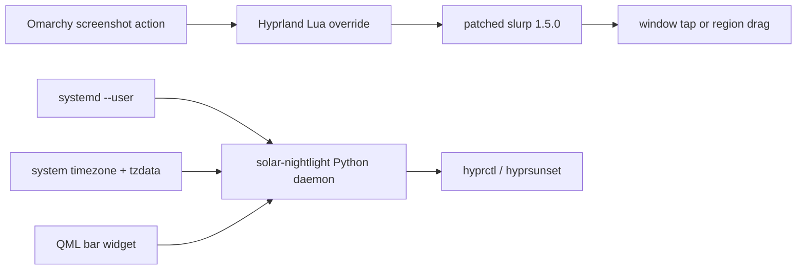

# Omarchy Customizations

Small Omarchy improvements I wanted on a touchscreen laptop, packaged so I can put them back after a fresh install without rebuilding the setup by hand.

## Why this exists

My laptop has a touchscreen, and I wanted screenshots to work the way they already feel natural on a phone or tablet: tap a window to capture it, or drag directly on the screen to select a region.

I also wanted the display to warm itself around sunset the way my desktop and phone do. The night-light integration follows the local solar day automatically, keeps manual control available, and does not need a network location lookup.

## Features

### Touchscreen Screenshots

Patches `slurp` 1.5.0 so that:

- A touchscreen tap selects the smallest window under the finger.
- A touchscreen drag selects a freeform region.
- An idle mouse highlight does not block touch input.
- The patched binary is installed in an isolated user path.
- A small Hyprland Lua override points Omarchy at the patched binary without modifying the stock configuration in place.

The installer fetches the matching upstream `slurp` release, applies the patch, builds it with Meson/Ninja, installs it under `~/.local`, reloads Hyprland, and checks for configuration errors.

### Solar Night Light

- Uses the active IANA system timezone and local `tzdata` tables to obtain representative coordinates; there is no fixed city and no network geolocation.
- Recalculates sunrise and sunset every day.
- Fades between the configured day and night color temperatures around each solar event.
- Supports both automatic solar scheduling and custom times.
- Preserves persistent manual control: off stays off until re-enabled, while on follows the selected schedule.
- Runs as a `systemd --user` service and follows timezone changes.
- Replaces only the stock Night Light indicator with a user-owned QML widget.
- Left-click toggles the night light; right-click opens controls for schedule, fade duration, warmth, and automatic or manual location.

Set the host timezone normally with:

```bash
timedatectl set-timezone Region/City
```

## Architecture



The two features are independent. The top-level installer installs both; each feature also keeps its own installer and files.

## Install

```bash
gh auth login
gh repo clone BenDManning/omarchy-customizations
cd omarchy-customizations
./install.sh
```

## Remove

Touchscreen files:

```bash
rm -f ~/.local/lib/omarchy-touchscreen/slurp
rm -f ~/.config/hypr/touchscreen-screenshot.lua
```

Then remove `require("hypr.touchscreen-screenshot")` from `~/.config/hypr/hyprland.lua`.

Solar night-light files:

```bash
systemctl --user disable --now omarchy-solar-nightlight.service
rm -f ~/.local/bin/omarchy-solar-nightlight
rm -f ~/.config/systemd/user/omarchy-solar-nightlight.service
systemctl --user daemon-reload
```

## Upstream and attribution

The touchscreen change is maintained here as a patch against `slurp` 1.5.0 rather than as a vendored copy of the project. `slurp` is an upstream project by emersion and contributors and is licensed under the MIT License. See [THIRD_PARTY_NOTICES.md](THIRD_PARTY_NOTICES.md).

Omarchy, Hyprland, hyprsunset, Quickshell, and the other projects this repository integrates with remain separate upstream projects. This repository is an independent customization layer and is not an official Omarchy project.

## License

Original code in this repository is available under the MIT License. See [LICENSE](LICENSE). Third-party code and projects retain their own licenses.
